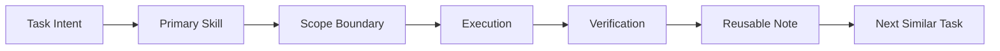

# AI Skill Routing Playbook

This playbook explains how I route AI-assisted work across writing, review, verification, document handling, and publishing without letting every task become a tool-selection mess.

The practical question is:

```text
When AI tools keep multiplying, how do I choose the right entry point, keep boundaries clear, and leave reusable lessons after the task?
```

## What This Shows

This package shows three parts of my AI operating method:

- task-first skill selection
- boundary control between generation, review, verification, and formatting
- lightweight governance for reusable workflows

It is a decision framework for public review.

## Core Rule

```text
Choose by task type, not by tool excitement.
```

A skill should be selected because the task has a specific shape. A writing task, a review task, a file conversion task, and a publishing task need different entry points. Mixing them too early makes the AI system harder to inspect.

## Public Model



## The Four Questions

Before using a skill, I ask:

1. What is the main deliverable?
2. Is the task about creation, review, verification, conversion, or publishing?
3. What should this skill not do?
4. What evidence proves the task is done?

These four questions prevent tool sprawl. They also make it easier to explain why a task used one route instead of another.

## Skill Boundary Map

| Work Type | Primary Question | Boundary To Keep |
| --- | --- | --- |
| Writing | What needs to be written or revised? | Do not let writing tools invent facts, sources, or personal experience. |
| Review | What risk or quality issue must be checked? | Do not let review tools silently rewrite the work. |
| Research | What question needs evidence? | Separate search, synthesis, and final writing. |
| Document Work | What file needs to be created or inspected? | Keep formatting work separate from content judgment. |
| Publishing | What is allowed to be released publicly? | Confirm scope, audience, and destination before upload. |
| Maintenance | What needs to stay consistent over time? | Do not turn a one-time cleanup into a broad refactor. |

## Why It Matters

The skill itself is not the capability. The capability is knowing when to use it, where it stops, and how to verify the result.

That is the difference between collecting AI tools and operating an AI workflow.

## Public Files

| File | Purpose |
| --- | --- |
| `routing-principles.md` | The routing rules I use before selecting a skill. |
| `writing-skill-boundaries.md` | How I separate drafting, editing, review, and style cleanup. |
| `governance-notes.md` | How I treat reusable workflows and tool conflicts. |
| `public-scope.md` | What this public package does and does not claim. |
| `cards/` | Short reusable concept cards. |

## Status

Status: `local_review_v1`

This is a public draft for review before upload.
