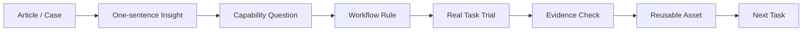

# AI Workflow Learning System

中文名：从 AI 文章到 AI 能力

This is my distilled framework for turning AI articles, product cases, engineering essays, and tool practice into reusable personal capability.

它关注一个更实际的问题：

```text
我怎样把读到的 AI 方法，变成自己下次真的能用的工作方式？
```

## Core Thesis

AI 能力的提升，发生在这条链路里：

```text
Reading -> Framing -> Workflow -> Evidence -> Review -> Reuse
```

也就是：

1. 读到一个概念。
2. 判断它解决哪类真实任务。
3. 把它改写成流程、模板、检查清单或 Skill 候选。
4. 在真实任务里使用。
5. 用证据验收。
6. 把成功和失败沉淀回个人系统。

## My Working Model



## The Six Ideas I Keep

| Idea | What It Means For Me |
| --- | --- |
| Harness over prompt | Build a better working environment for AI. |
| Human role moves upward | My job shifts from line-by-line control to goals, boundaries, checkpoints, and acceptance. |
| State must live outside chat | Long tasks need files, reports, specs, and handoffs, not memory hope. |
| Loop before automation | Only automate repeated, verifiable, affordable tasks with enough tool access. |
| Evidence beats confidence | AI saying "done" is not evidence. Tests, artifacts, reviews, and behavior are evidence. |
| Reuse is the real gain | A task is not fully learned until it becomes a rule, template, checklist, or Skill candidate. |

## From Article To Capability

When I read an AI article, I ask:

```text
1. What task does this help me do better?
2. Is the lesson about model capability, context, tools, state, evaluation, or workflow?
3. Can I turn it into a reusable rule?
4. Can I test it in a real task?
5. What would count as evidence that it works?
6. Where should the lesson live after the task?
```

## K/S/T Knowledge Split

For important work, I split knowledge into three layers:

| Layer | Meaning | Example Asset |
| --- | --- | --- |
| K: Knowledge | Facts, domain concepts, source understanding | notes, summaries, concept maps |
| S: Standards | Roles, boundaries, delivery contracts | rules, checklists, acceptance criteria |
| T: Tactics | Workflow order, checkpoints, review loops | SOPs, task templates, handoffs |

This prevents one giant prompt from mixing facts, rules, workflow, and preferences together.

## Capability Flywheel

```text
Read -> Extract -> Apply -> Verify -> Reflect -> Codify -> Reuse
```

The key is lowering the friction from reading to reuse.

## Practical Rule

Every serious AI-related reading note should end with at least one of these:

- a workflow rule
- a task template
- a checklist
- a failure pattern
- a review question
- a Skill candidate
- a testable next action

Information becomes capability only after it changes how I work.

## Concept Cards

| Card | Use |
| --- | --- |
| `AI使用手册.md` | 中文版个人 AI 使用方法手册，包含阅读成果到能力变化的沉淀。 |
| `AI-Usage-Handbook.md` | English version of the personal AI usage handbook. |
| `cards/harness-over-prompt.md` | Build the environment around the model. |
| `cards/loop-engineering.md` | Decide when a task deserves a loop. |
| `cards/evidence-chain.md` | Replace confidence with verifiable evidence. |
| `cards/kst-knowledge-system.md` | Separate knowledge, standards, and tactics. |
| `cards/human-checkpoint-role.md` | Move human value to architecture and review. |
| `cards/skill-candidate-rule.md` | Know when a repeated workflow should become a Skill. |
| `cards/context-to-state.md` | Move long-task memory from chat into files. |

## Public Scope

This folder contains my own framework and reusable concepts.

It intentionally excludes:

- original article text
- converted Markdown sources
- long excerpts
- PDFs, DOCX files, and images
- private drafts
- raw OCR material
