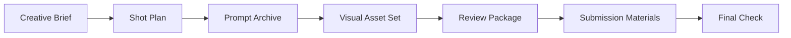

# AIGC Video Production Pipeline

This showcase summarizes a private AIGC video production project as a public-safe workflow case.

The project produced a short AI-generated video and a managed production package around it: shot planning, prompt tracking, visual asset review, document packaging, and submission readiness checks.

In this context, "production package" means the material needed to explain, inspect, and hand off the work. It is separate from the video file itself.

## What This Shows

This public package focuses on:

- translating a creative brief into a production workflow
- tracking visual generation work across shots and assets
- turning prompts and review notes into structured artifacts
- packaging review materials into documents and spreadsheets
- using quality checks before final delivery

It stays at the level of workflow design, project organization, and quality control.

## Public Model



## My Role

My work centered on production systemization. I organized the work around the question:

```text
How do we keep story, visual assets, prompts, documents, and final checks aligned while the project keeps changing?
```

That included:

- structuring the project into repeatable stages
- maintaining prompt and shot documentation
- generating review-ready documents and workbooks
- creating QA previews for visual inspection
- separating draft materials from release-ready materials

The public version does not present the full creative source material or the complete operating process.

## Why This Matters

AIGC video work can become chaotic quickly because small changes in a scene, character, prompt, or document can break consistency elsewhere. The main challenge is keeping story, shots, prompts, visual references, review notes, and submission materials aligned.

This project shows that I can manage AI creative work as a production system, not as a one-off generation attempt.

## Public Files

| File | Purpose |
| --- | --- |
| `workflow.md` | High-level production workflow. |
| `quality-checks.md` | Goals and checks used before delivery. |
| `public-artifact-map.md` | Public-safe artifact categories. |
| `public-scope.md` | What this public package claims and where it stops. |
| `cards/` | Short concept cards distilled from the project. |

## Status

Status: `local_review_v1`

This is a public draft for review before upload.
