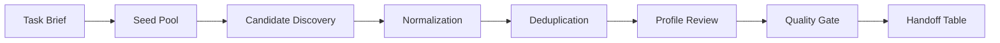

# Creator Discovery Pipeline

This showcase summarizes a private creator and KOL discovery project as a public workflow case.

The work turned scattered public signals into a controlled review package: lead discovery, profile normalization, deduplication, eligibility checks, contact availability, human review, and final handoff tables.

## Contents

This folder covers:

- converting a broad growth task into a data pipeline
- separating discovery, enrichment, scoring, review, and handoff
- using exclusion lists before collecting new candidates
- keeping uncertain fields visible while guesses stay out of the table
- protecting private names, accounts, contact data, platform details, and full operating recipes

The scope stays at system design, quality control, and public examples.

## System Model

## My Role

My work centered on turning creator discovery into a controlled operating loop.

That included:

- defining the intake brief and output fields
- designing deduplication and exclusion rules
- separating raw candidates from reviewed candidates
- creating review gates for profile fit, activity, contactability, and risk
- packaging results into workbook-style handoff artifacts
- keeping sensitive inputs and original outputs out of the public version

## Why This Matters

Creator discovery can look simple from the outside: search, copy names, make a sheet.

The harder part is governance. A useful lead pipeline needs repeatable definitions, controlled exclusions, traceable decisions, and human checkpoints before anything becomes a business-facing list.

This project records that operating structure.

## Public Files

| File | Purpose |
| --- | --- |
| `architecture.md` | Pipeline layers and responsibilities. |
| `evidence-and-review.md` | Review gates, evidence classes, and acceptance states. |
| `redaction-policy.md` | What stays out of the public folder. |
| `public-sample.md` | Fake rows and public field examples. |
| `../../shelves/code/creator-discovery-skeleton/` | Small governance skeleton with fake data only. |

## Status

Status: `approved_for_public_v1`

This is a public adaptation, not the original private workspace.
