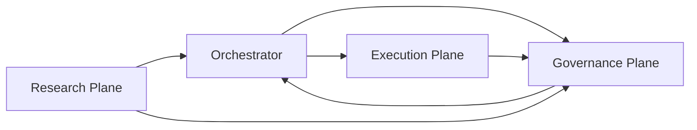

# Architecture

The private system was organized around explicit operating planes.

This note keeps the architecture visible while leaving domain-specific strategy logic out.

## Plane Model



## Research Plane

Purpose:

- generate research questions
- build candidate artifacts
- run validation workflows
- produce research evidence

Boundary:

- research output is not execution authority
- research output is not a production claim
- candidate artifacts require governance review before downstream use

## Execution Plane

Purpose:

- define dry-run lifecycle schemas
- model order intent, event, reconciliation, and incident records
- support runtime safety design

Boundary:

- no real orders
- no credentials
- no live or paper enablement
- no leverage escalation

## Governance Plane

Purpose:

- classify evidence
- decide whether claims are allowed
- enforce fail-closed promotion gates
- block unsafe readiness claims
- require human review for protected changes

Boundary:

- governance can block or approve evidence classes
- governance does not silently grant trading authority

## Orchestrator

Purpose:

- select one authorized task
- map it to the right plane
- enforce policy before action
- collect artifacts and decision records

Boundary:

- no override of governance decisions
- no execution authority by routing alone
- no hidden multi-task drift

## Design Principle

The system treats autonomy as a bounded workflow:

```text
intent -> policy check -> run -> artifact -> audit -> classification -> next action
```
