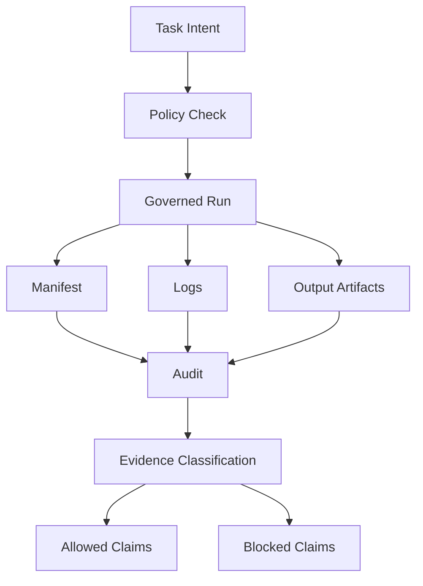

# Evidence Lifecycle

The system treats outputs as evidence only after they are recorded, classified, and audited.

## Lifecycle

## Evidence Classes

| Evidence Class | Can Support | Cannot Support |
| --- | --- | --- |
| research artifact | research direction, hypothesis quality | production readiness |
| public market data | market observation, replay study | account execution claim |
| dry-run execution | schema, reconciliation, lifecycle design | real fills or real orders |
| governance audit | boundary check, claim control | automatic promotion |
| human-approved package | reviewed next-stage readiness | silent live authority |

## Why This Exists

AI agents often produce many files. Without an evidence lifecycle, outputs become clutter.

This system makes artifacts answerable:

- What produced this?
- Under what policy?
- What does it prove?
- What does it not prove?
- What is the next allowed action?

